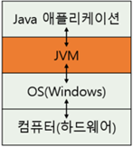
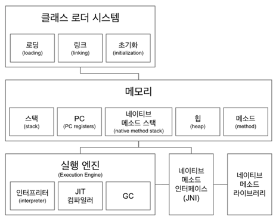
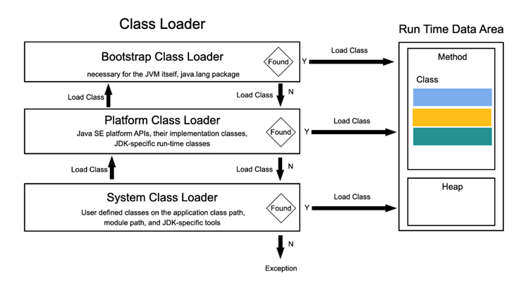
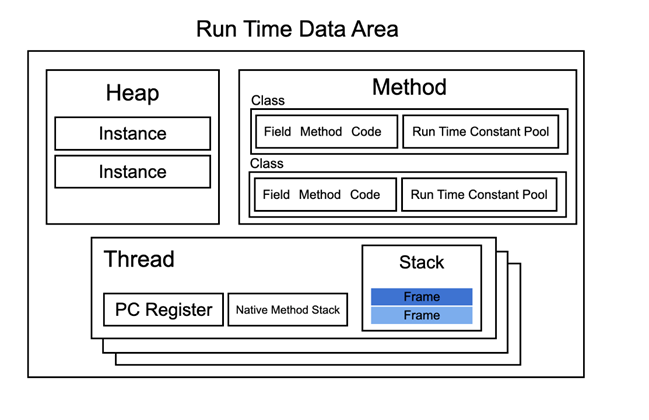
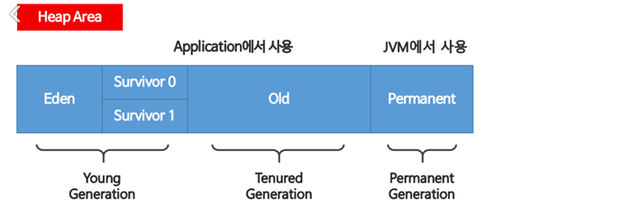
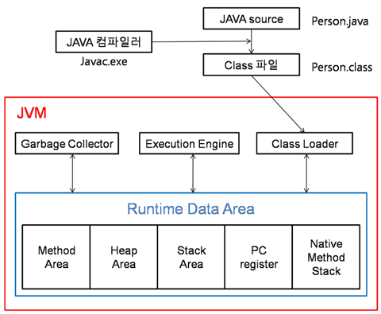
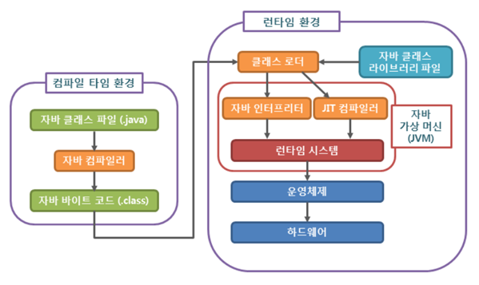
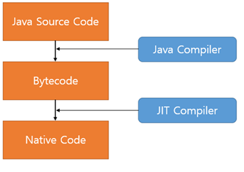

## JVM이란 무엇인가
### JVM=Java Virtual Machine 
- 자바를 실행하기 위한 가상 기계, 자바 프로그램 실행환경을 만들어주는 소프트웨어
- 자바 바이트코드(.class 파일)를 OS에 특화된 코드로 변환하여 실행  
  -> 변환이유 : 일반 어플리케이션 코드는 OS만 거치고 하드웨어로 전달되지만 Java어플리케이션은 JVM을 한 번 더 거침   
   
-> 왜? 하드웨어에 맞게 완전이 컴파일 된 상태가 아니라 실행 시에 해석되기 때문에 속도가 느림. 최근에 바이트코드를 하드웨어의 기계어로 바로 변환해주는 JIT 컴파일러와 향상된 최적화 기술 적용으로 속도 격차가 줄어듦   
-> 주의사항 : JVM이 없을 경우 어플리케이션은 OS와 바로 맞붙어 있기 때문에 OS에 종속적. 다른 OS에 실행시키기 위해서는 어플리케이션을 그 OS에 맞게 변경
- JVM을 사용하는 Java 어플리케이션은 JVM하고만 상호작용을 하기 때문에 OS가 달라지더라도 프로그램 변경 없이 실행 가능
- Java 언어로 작성된 Test.java는 컴파일하면 Test.class 파일이 생성되고 이 바이트코드는 각자의 플랫폼에 설치되어 있는 JVM이 운영체제에 맞는 실행 파일로 바꿔줌.
#### = 자바는 어떠한 플랫폼에 영향을 받지 않음. 하나의 바이트코드로 모든 플랫폼에서 동작 가능
##### ** Java는 플랫폼에 종속적이지 않지만 JVM은 플랫폼에 종속적
-> Java는 컴파일된 바이트코드로 어떤 JVM에서도 동작이 가능하여 플랫폼에 의존적이지 않지만 JVM은 의존적.   
-> 실제 컴퓨터로부터 Java 어플리케이션 실행을 위한 메모리를 할당 받아 Runtime Data Area를 구성함
### 컴파일 과정
- .java 파일이 컴파일러를 통해 전달된 다음 소스코드를 바이트코드로 인코딩함
- 소스파일에 포함된 각 클래스의 내용은 별도의 .class 파일에 저장됨. (소스코드 -> 바이트코드 변환시 컴파일러는 다음 단계를 따름)
  * Parse : .java 소스파일을 읽은 뒤 결과 토큰을 AST(Abastract Syntax Tree)노드에 매핑
  * Enter : 정의된 심볼들을 심볼테이블에 저장
  * Process annotations : 요청된 경우 지정된 컴파일 위치에서 찾은 annotations을 처리
  * Attribute : 구문 트리에 속성을 부여하며 이름 확인, 유형 검사 및 상수 정의가 포함
  * Flow : 이전 단계의 트리에 대한 데이터 흐름을 분석, 할당 및 도달 가능성에 대한 검사
  * Desugar : AST를 다시 작성하고 몇몇 syntatic sugar들을 번역
  * Generate : .class 파일을 생성   
### Terminal에서 컴파일
- 작성한 코드가 있는 위치로 이동해 javac 파일명 .java 명령어 작성
- .class 파일 생성 확인
### JVM 구성 요소

- 클래스 로더가 컴파일 된 자바 바이트코드를 메모리 영역에 로드하고, 실행 엔진이 자바 바이트 코드를 실행
- 자바는 런타임에 클래스를 처음으로 참조할 때 해당 클래스를 로드하고 링크하는 특징
- 이 동적 로드를 담당하는 부분이 JVM의 클래스 로더
   
- 특징
    + 계층 구조 : 클래스 로더간 부모-자식 관계를 이뤄 계층 구조로 생성.    
      최상위 클래스 로더는 부트스트랩 클래스 로더(Bootstrap Class Loader)
    + 위임 모델 : 계층 구조를 바탕으로 클래스 로더끼리 로드를 위임하는 구조로 동작.   
      클래스를 로드할 때 먼저 상위 클래스 로더를 확인하여 상위 클래스 로더에 있다면 해당 클래스를 사용하고 없다면 로드를 요청받은 클래스 로더가 클래스를 로드함.
    + 가시성(visivlility) 제한 : 하위 클래스 로더는 상위 클래스 로더를 찾을 수 있지만 상위 클래스 로더는 하위 클래스 로더의 클래스 찾기 불가능
    + 언로드 불가 : 클래스 로더는 클래스를 로드할 수는 있지만 언로드 할 수 없음.   
      현재 클래스 로더를 새로 삭제하고 새로운 클래스 로더 생성 가능
- 종류
    + Bootstrap Class Loader : 네이티브 코드로 작성되었으며 JVM에 내장됨
      JVM이 시작될 때 실행되며 java.lang package 처럼 JVM 실행에 필요한 클래스들을 로딩함
    + Extension Class Loader(=Platform Class Loader) : java.lang.ClassLoader의 인스턴스로 Java SE platform API 등 자바에서 기본적으로 제공해주는 클래스를 로딩할 때 사용
      Bootstrap Class Loader를 부모로 가짐
    + Application Class Loader (System Class Loader) : java.lang.ClassLoader의 인스턴스로 유저가 작성한 클래스를 로딩할 때 사용
      Classpath에 명시된 경로를 통해 클래스를 찾음
      Extension Class Loader(=Platform Class Loader)를 부모로 가짐
    + User-Defined Class Loader : 어플리케이션 사용자가 직접 코드 상에서 생성해서 사용하는 클래스 로더
### JVM 시작
- JVM이 시작되면 런타임 데이터 영역이 생성되고 그 안에 메소드, 힙 영역이 할당됨
- JVM에 내장된 Bootstrap Class LOader는 java.lang.package 처럼 JVM 실행에 필요한 클래스들을 메소드 영역으로 로딩함
- System Class Loader를 통해 실행한 클래스를 메소드 영역으로 로딩함
- 기본 클래스 파일이 JVM으로 전달된 다음 최종 코드가 실행되기 전 주요 3가지의 단계를 거침
1. 로딩
    - 클래스 로더가 .class 파일을 열고 그 내용에 따라 적절한 바이너리 데이터를 만들어 메소드 영역에 저장
    - 이때 메소드 영역에 저장하는 데이터는 다음과 같음
      - FACN(Fully Quallified Class Name)
      - 클래스 | 인터페이스 | 이넘(Enum)
      - 메소드와 변수
    - 로딩이 끝나면 해당 클래스 타입의 Class 객체를 생성하여 힙(heap)영역에 저장
2. 링크
    - Verify, Prepare, Reslove(Option) 세 단계로 나뉨
      - 검증(verify) : .class 파일 형식이 유효한지 체크, JVM 명세를 따르고 있는지 검증
      - 준비(preparation) : 클래스 변수(static)와 기본값이 필요한 메모리 준비
        정적 필드를 각 유형의 기본값으로 초기화하는 과정 -int type은 0으로, reference type은 null로 초기화
      - Resolve : 심볼릭 메모리 레퍼런스를 메모리 영역에 있는 실제 레퍼런스로 교체
3. 초기화
    - Static 변수와 값을 할당(static block이 있다면 이때 실행)
      초기화 과정은 로딩-검증-준비 과정이 모두 끝났을 때 한번만 실행
### JVM 종료
- 일부 스레드가 runtime 클래스의 종료 메소드나 중지 메서드, 클래스 시스템의 종료 메서드를 호출하면 JVM 종료 또는 중지 작업이 Security Manager에 의해 허용
### 메모리
- JVM의 메모리 영역으로 자바 어플리케이션을 실행할 때 사용되는 데이터들을 적재하는 영역
    - 스택 영역 : 지역 변수, 파라미터, 리턴 값, 연산에 사용되는 임시 값 등이 생성되는 영역으로 클래스 수준의 정보를 저장, 공유자원
    - PC Register : 스레드가 생성될 때마다 생성되는 영역으로 현재 스레드가 실행되는 부분의 주소와 명령을 저장하고 있는 영역   
      이것을 이용해 스레드를 돌아가며 수행가능
    - 네이티브 매소드 스택 : 자바 외 언어로 작성된 네이티브 코드를 위한 메모리 영역으로 보통 C/C++ 등의 코드를 수행함
    - 힙(heap) : new 키워드로 생성된 객체와 배열이 생성되는 영역
      매소드 영역에 로드된 클래스만 생성이 가능하고 Garbage Collector가 참조되지 않는 메모리를 확인/제거하는 영역
      객체의 인스턴스는 힙 영역에 생성
      스택 영역에는 힙 영역의 주소값을 저장
    - 메소드 영역 : 모든 스레드가 공유하는 영역으로 JVM이 시작될 때 생성
      저장하는 내용은 JVM이 읽은 각각의 클래스, 인터페이스에 대한 런타임 상수 풀, 필드와 메서드 정보, static 변수, 메서드의 바이트코드 등을 저장
### 실행 엔진(Execution Engine)
- 클래스 로더에 의해 메모리에 적재된 클래스들을 기계어로 변경해 명령어 단위로 실해
  - 인터프리터 방식
  - JIT 컴파일러
  - 더 이상 참조되지 않는 객체를 모아서 정리하는 GC(Garbage Collector)
### JIN(Java Native Interface) 네이티브 메소드 인터페이스 & 라이브러리
- Java 언어 자체로 해결이 안되는 경우, 대처 할 수 있는 방법 중 하나
- 자바 어플리케이션에서 C/C++,어셈블리로 작성된 함수를 사용할 수 있는 방법 제시
- Native Keyword를 사용한 메소드 호출
### Runtime Data Area
- JVM의 메모리 영역으로 자바 어플리케이션을 실행할 때 사용되는 데이터들을 적재하는 영역

- 모든 스레드가 공유해서 사용(GC의 대상)
  - 힙 영역(Heap Area) : new 키워드로 생성된 객체와 배열이 생성되는 영역
    주기적으로 GC가 제거하는 영역
  
    - Heap Area는 3가지 영역으로 나뉨
    - Young Generation 영역은 자바 객체가 생성되자마자 저장되고 생긴지 얼마 안되는 객체가 저장되는 공강
    - Heap 영역에 객체가 생성되면 최초로 Eden 영역에 할당됨
    - 이 영역에 데이터가 어느정도 쌓이게 되면 참조정도에 따라 Servior의 빈 공간으로 이동되거나 회수
    - Young Generation(Eden+Servivor) 영역이 차게 되면 또 참조정도에 따라 Old 영역으로 이동되거나 회수
    - Young Generation과 Tenured Generation에서의 GC를 Minor GC라고 함
    - Old영역에 할당된 메모리가 허용치를 넘게되면 Old영역에 있는 모든 객체들을 검사하여 참조되지 않는 객체들을 한꺼번에 삭제하는 GC실행
    - 시간이 오래 걸리는 작업이며 이때 GC를 실행하는 스레드를 제외한 모든 스레드의 작업이 멈춤 (=Stop-the-World)
    - Stop-the-World가 발생하고 Old영역의 메모리를 회수하는 GC를 Major GC라고 함
  - 메서드 영역(Method Area) : 클래스 멤버 변수의 이름, 데이터 타입, 접근 제어자 정보와 같은 각종 필드 정보들과 메서드 정보, 데이터 타입 정보, Constant Pool, static 변수, final class 등이 생성
    - Runtime Constant Pool : 클래스, 인텊페이스 마다 존재하며 클래스 파일의 constant pool 테이블 영역이 저장되는 공간, 각 클래스, 인터페이스이 전역 변수, 함수, 인스턴스 변수, 함수에 대한 심볼릭 링크가 존재함
      전역 변수와 전역 함수는 컴파일 시점에 할당되어 고정된 값으로 존재하며 인스턴스 변수와 인스턴스 함수는 심볼릭 링크로 존재하며 실행 시점에 고정된 주소로 변환됨
      런타임 상수 풀은 클래스가 생성되어 Heap에 할당될 때 만들어지며 클래스가 삭제되면 사라짐
  - 스레드(Thread)마다 하나씩 생성
    - 스택 영역(Stack area) : 지역변수, 파라미터, 리턴 값, 연산에 사용되는 임시 값 등이 생성되는 영역
    - Frame : 데이터, 반환 값을 저장하는 자료구조, 함수가 호출될 때 생성되고 함수가 종료되면 사라짐
      각 프레임은 지역 변수 배열, Operand Stack, Run Time Constant Pool에 대한 참조값을 지님
      클래스파일의 함수에 대한 접근은 Runtime Constant Pool에 존재하는 심볼릭 링크를 통해 접근 가능함
      동적 할당은 코드 실행 시점에 심볼릭 링크를 해석해 고정된 주소값으로 변환
      심볼릭 링크를 통한 late-binding은 객체 지향의 핵심
    - PC 레지스터(PC Register) : Thread가 생성될 때마다 생성되는 영역으로 프로그램 카운터, 현재 스레드가 실행되는 부분의 주소와 명령을 저장하고 있는 영역
    - 네이티브 메서드 스택(Native Method Stack) : 자바 이외의 언어로 작성된 네이티브 코드를 실행하라 때 사용되는 메모리 영역으로 일반적인 C스택을 사용
      보통 C/C++등의 코드를 수행하기 위한 스택을 말하며 자바 컴파일러에 의해 변환된 자바 바이트코드를 읽고 해석하는 역할을 하는 것이 자바 인터프리터임
### JVM의 동작 방식

1. 자바로 개발된 프로그램을 실행하면 JVM은 OS로부터 메모리를 할당
2. 자바 컴파일러(javac)가 자바 소스코드(.java)를 자바 바이트코드(.class)로 컴파일
3. Class Loader를 통해 JVM Runtime Data Area로 로딩
4. Runtime Data Area에 로딩 된 .class들은 Execution Engine을 통해 해석
5. 해석된 바이트 코드는 Runtime Data Area의 각 영역에 배치되어 수행되며 이 과정에서 Execution Engine에 의해 GC의 작동과 스레드 동기화가 이루어짐

#### cf) OS(Operating System 운영체제)
- 컴퓨터 시스템의 자원들을 효율적으로 관리하며 사용자가 컴퓨터를 편리하고 효과적으로 사용하 수 있도록 환경을 제공하는 여러 프로그램의 모임
- 운영체제의 목적은 처리능력 향상, 사용 가능도 향상, 신뢰도 향상, 변환 시간 단축 등
- 운영체제의 성능 평가 기준 : 처리능력, 반환시간, 사용가능도, 신뢰도
  - 처리능력 : 일정 시간 내에 시스템이 처리하는 일의 양
  - 반환시간 : 시스템에 작업을 의뢰한 시간부터 처리가 완료될 때까지 걸린 시간
  - 사용가능도 : 시스템을 사용할 피료가 있을 때 즉시 사용 가능한 정도
  - 신뢰도 : 시스템이 주어진 문제를 정확하게 해결하는 정도
- 운영체제 기능
  - 프로세서, 기억장치, 입출력장치, 파일 및 정보 등의 자원 관리
  - 자원을 효율적으로 관리하기 위해 자원의 스케줄링 기능 제공
  - 사용자의 시스템간의 편리한 인터페이스 제공
  - 시스템의 각종 하드웨어와 네트워크를 관리, 제어
  - 데이터를 관리하고 데이터 및 자원의 공유 기능을 제공
  - 시스템의 오류를 검사하고 복구
  - 자원 보호 기능 제공
  - 입출력에 대한 보조 기능 제공
  - 가상 계산기 능력 제공
##### Java bytecode(=자바 바이트코드)
- JVM이 실행하는 명령어의 형태로 각각의 바이트코드는 1바이트로 구성되지만 몇 개의 파라미터가 사용되는 경우가 있어 총 몇 바이트로 구성되는 경우가 있음
##### JDK
- 자바 개발 환경으로 자바 어플리케이션을 개발하기 위해 필요한 도구 제공
  - Javac(=자바 컴파일러) : 자바 언어를 바이트 코드로 컴파일함
  - Javap(=역 어셈블리어) : 자바 클래스 파일을 해석
##### JRE(Java Runtime Environoment=자바 실행 환경)
- JVM, 자바 클래스 라이브러리, 기타 자바 어플리케이션 실행에 필요한 파일들 포함
- 개발 관련 도구는 포함 안됨(JDK에서 제공)
##### Garbage Collector 
- JVM의 Heap 영역에서 동적으로 할당했던 메모리 영역 중 필요 없게 된 메모리 영역을 주기적으로 삭제하는 프로세스
    - 단점
      - 개발자가 메모리가 언제 해제되는지 정확하게 알 수 없음
      - GC가 동작하는 동안에는 다른 동작을 멈추기 떄문에 오버헤드 발생
###### 추가사항
- Hot Spot JVM : hot한 spot을 찾아 그 부부네서 JIT 컴파일러를 사용하는 JVM
- 내부적으로 프로파일링을 통해 핫스팟을 찾아 해당 부분에 대한 네이티브를 생성하는데 네이비트 코드를 만드는 방법으로 Client와 Server 두 방법이 존재
  Java SE 안에 포함되어 있어 시작 시 모드 선택 가능
  1. Clinet : 스타트업 시간과 메모리공간 최적화 중점 모드
    - Client 모드에서 동작하는 컴파일러는 주로 프로그램의 시작 시간을 최소화함
      이 모드에서는 바이트코드로부터 최대한 많은 정보를 뽑아 실제 동작하는 코드 블록에 대한 최적화 집중하며 전체적인 최적화에는 관심 없음
        1. 바이트 코드를 해석한 뒤 최적화를 쉽게 하기 위해 HIR이라는 정적 바이트 코드 표현을 만듦
        2.  HIR로부터 플랫폼에 종속적인 중간표현식(LIR)을 만듦
        3. LIR을 사용해 기계어를 생성
   2. Server : 다수의 request를 빠르게 처리하는데 중점을 둔 모드
     - 이때 JIT는 부분적인 코드 실행보다는 전체적인 성능 최적화에 관점을 둠
        1. 일반적인 컴파일러 최적화 기술들을 이용해 코드들을 최적화함
            - 죽은 코드 삭제(Dead Code Elimination)
            - Loop 변수 끌어올리기(Loop inariants hoisting)
            - 공통 부분식 제거(Common Subpression Elimination)
            - 상수 지연(Constant propagation)
            - 전역 코드 이동(Global Code motion)
        2. 자바에 최적화된 최적화를 진행
            - Null Check 삭제
            - 배열의 Range Check 삭제
            - 예외처리 경로 최적화
## 자바의 동작원리
### 자바 프로그램의 실행 과정

- 자바로 .java 코드를 작성하고 파우쉘이나 터미널에 있는 자바 컴파일러인 javac에 컴파일명령을 내리면 .class 파일이 만들어짐
- 이 바이트 코드는 클래스 로더를 통해 JVM Runtime Data Area로 로딩되고 로딩된 .class 바이트 코드를 실행할 컴퓨터에 깔린 JVM에 가져다주면 그 컴푸터가 이 프로그램을 실행할 때 이 JVM이 그때그때 기계어로 해석
- 어플리케이션이 동작할 때 코드를 분석하여 bottleneck 또는 HotSpot을 탐지함
- Hotspot 가상머신은 성능 향상을 위해 코드의 성능에 중요한 부분을 컴파일하지만 거의 사용되지 않는 코드(대부분의 어플리케이션)는 컴파일하지 않음
- HotSpot 가상머신은 코드를 컴파일 하는 방법을 최적화하기 위해 라인별 adaptive compiler를 사용
- HotSpot 가상머신은 라인별로 바이트 코드를 읽어 기계어로 변환해 실행하며 기본적으로는 인터프리터를 통해 실행을 하지만 자주 등장하는 바이트 코드일 경우 JIT 컴파일러를 사용해 컴파일을 하는 방법을 통해 실행 방법을 최적화 시킴
#### 바이트 코드를 읽는 방식
1. Interpreter 방식
    - 바이트코드를 한 줄씩 해석, 실행하는 방식
        - 초기 방식으로 속도가 느림
2. JIT(=Just In Time) 컴파일 방식
    - 바이트코드를 JIT 컴파일러를 통해 프로그램을 실제 실행하는 시점(=바이트코드를 실행하는 시점)에 각 OS에 맞는 Native Code로 변환함
    - 그러나 JVM은 모든 코드를 JIT 컴파일 방식으로 실행하지 않고 인터프리터 방식을 사용하다가 일정 기준이 넘어가면 JIT 컴파일 방식으로 명령어를 실행
    - Native code는 캐시에 보관하기 때문에 한 번 컴파일된 코드는 계속 빠르게 수행
    - JVM내부에서 해당 메소드의 수행빈도를 확인 후 일정 정도를 넘을 때 컴파일을 수행함
   