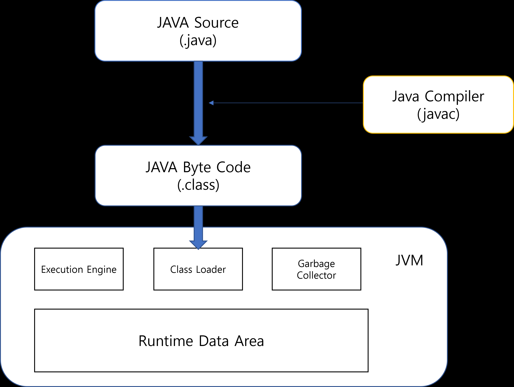

# JVM 이란
## Java Virtual Machune = 자바 가상 머신
##### Jav(자바)는 OS에 종속X, OS에 종속되지 않고 실행하려면 JVM이 필요하다.
##### OS에 종속받지 않고 CUP 가 Java를 인식, 실행할 수 있게 하는 가상 컴퓨터.
***
###### *OS = 운영체제 [하드웨어와 응요 프로그램 간의 상호작용을 관리 제어 역할]
###### *CPU = 중앙 처리 장치 [기억, 해석, 연산, 제어 역할]
***
#### 구성
- 클래스 로더
- 실행 엔진
    - 인터프리터
    - 컴파일러
    - 가비지 콜렉터
- 런타임 데이터 영역
 
 
### 클래스 로더
JVM 내 클래스 파일 로드, 링크를 통해 배치 작업을 수행하는 모듈. 
런 타임시 동적으로 클래스 로드, jar파일 내 저장된 클래스들을 JVM 위에 탑재.  
즉, 클래스를 처음 참조할 때, 해당 클래스를 로드하고 링크하는 역할.
### 실행 엔진
클래스를 실행시카는 역할이다.  
클래스 로더가 JVM내의 런타임 데이터 영역에 바이트 코드를 배치시키고, 이것은 실행 엔진에 의해 실행된다.  
자바 바이트 코드는 기계가 바로 수행할 수 있는 비교적 인간이 보기 편한 형태로 기술된 것이다. 
그래서 실행 엔진은 이와같은 바이트 코드를 실제로 JVM 내부에서 기계가 실행할 수 있는 형태로 변경한다.
#### ㄴ인터프리터
실행 엔진은 자바 바이트 코드를 명령어 단위로 읽어서 실행한다. 
하지만 한 줄씩 수행하기 때문에 느리다는 단점이 있다.
#### ㄴJIT
인터프리터 방식으로 실행하다가 적절한 시점에 바이트 코드 전체를 컴파일하여 기계어로 변경, 이후 해당 더 이상 인터프리팅x 기계어로 실행하는 방식
#### ㄴ가비지 콜렉터
더이상 사용되지 않는 인스턴스를 찾아 메모리에서 삭제.
***
###### *런 타임=프로그램이 실행되고 있는 동안의 동작
###### *컴파일=주어진 언어로 작성된 컴퓨터 프로그램을 다른 언어의 동등한 프로그램으로 변환하는 프로세스
***
### 런타임 데이터 영역
실제 클래스 파이링 적재되는 곳으로 JVM이 OS로부터 자바 프로그램 실행을 위한 데이터와 명령어를 저장하기 위해 할당받는 메모리 공간.
#### ㄴPC Register
#### ㄴJVM 스택 영역
#### ㄴNative method stack
#### ㄴMethod Area
#### ㄴRuntime Constant Pool
#### ㄴHeap 영역

***
###### *프로세스=실행중인 프로그램
###### *스레드=프로세스 내에서 실제로 작업을 수행하는 주체를 의미 모든 프로세스에는 한 개 이상의 스레드가 존재하여 작업 수행
***
 

# 자바 동작 원리
#### JAVA의 동작원리
.java 파일을 .javac(컴파일러)가 .class로 바꾸어 기계어로 변환 
이후 .class파일은 JVM을 통해 실행

1. 자바 소스( java source) 작성 -> .java로 저장
2. 컴파일러로 class 파일로 변환 
3. JVM 통해 실행, Class Loadar 통해 실행 가능
#### 자바 코드의 실행 과정
1. 개발자가 자바코드 작성
2. .java 인 파일을 자바 컴파일러를 통해 자바 바아트 코드로 컴파일
3. 컴파일 된 바이트 코드를 JVM의 Class Loader에 전달
4. Class Loader는 동적 로딩을 통해 필요 클래스들을 로딩 및 링크하여 Runtime Data Area에 올린다
5. 실행 엔진은 JVM메모리에 올라온 바이트 코드들을 명령어 단위로 하나씩 가져와서 실행
